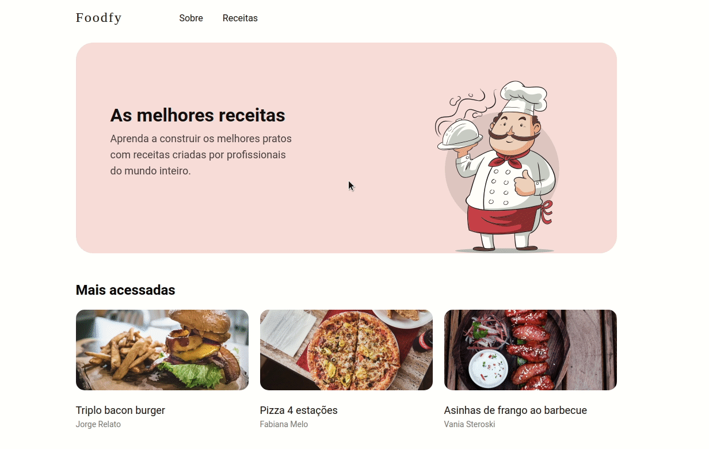
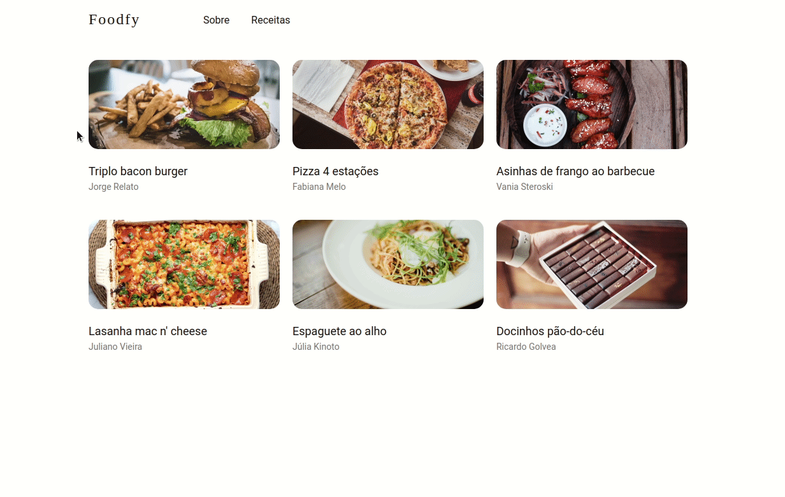

<div align="center">
  
</div>

# Foodfy
> Take your culinary skills to the next level. Cook, Explore & Manage Recipes.

<div align="center">
  
</div>

<div align="center" style="margin-top: 20px;">
  
</div>

<div align="center" style="margin-top: 20px;">
  
</div>


---
## :computer: Technologies used
- [JavaScript](https://www.javascript.com/)
- [NodeJS](https://nodejs.org/en/)
- [HTML](https://www.w3.org/TR/html52/)
- [CSS](https://www.w3.org/Style/CSS/Overview.en.html)
- [nunjucks](https://mozilla.github.io/nunjucks/)
- [nodemon](https://nodemon.io/)

---
### 📁 How to download and run this project

you will need [NodeJS](https://nodejs.org/en/) in your computer
```bash
  #run this command to confirm if you have Node
  node -v
  #or
  node --version
```

```bash
  # clone the repository
  $ git clone https://github.com/juliocesarfs/foodfy.git
```

Run the commands bellow:
```bash
  # Install dependences
  npm install
```
**To start the server:**
```bash
  npm start
```
> The project will default to port 5000

**Acess in your browser:**
```
localhost:5000
```


# 📕 License

Under development. Released in 2021. This project is under the [MIT license](https://github.com/Crucciatus/foodfy/blob/master/LICENSE)

Made with 💜 by [*Júlio César*](https://github.com/juliocesarfs) 🚀
